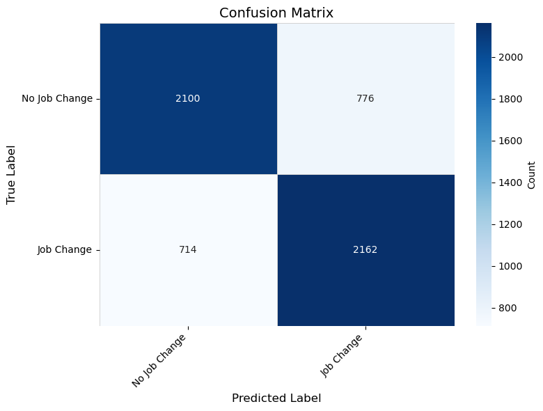

# Lab 2 — HR Analytics: Job Change of Data Scientists

[**Repo Link**](https://github.com/ThuongHong/lab2_ds.git) 

A NumPy machine learning project to predict whether a candidate will change jobs (binary classification) using an HR Analytics dataset (mostly categorical features). The repo includes a preprocessing pipeline, class balancing with SMOTEN (categorical SMOTE), a Categorical Naive Bayes model with Laplace smoothing, visualization utilities, and submission generation.

## Table of Contents
- [Introduction](#introduction)
- [Dataset](#dataset)
- [Method](#method)
- [Installation & Setup](#installation--setup)
- [Usage](#usage)
- [Results](#results)
- [Project Structure](#project-structure)
- [Challenges & Solutions](#challenges--solutions)
- [Future Improvements](#future-improvements)
- [Contributors](#contributors)
- [Author Info](#author-info)
- [Contact](#contact)
- [License](#license)

## Introduction
- Problem: Predict the binary target “job_change” (1: likely to switch jobs, 0: not) from personal, education, experience, and company information.
- Motivation & applications: Support recruitment prioritization, analyze potential employee churn, and make data-informed decisions.
- Goals:
  - Build a NumPy-only preprocessing pipeline for categorical data with missing values.
  - Handle class imbalance using SMOTEN for categorical features.
  - Train a Categorical Naive Bayes model with Laplace smoothing and report standard metrics.
  - Visualize distributions and categorical associations (Cramér’s V, nullity correlation).

## Dataset
- Source: [Kaggle — HR Analytics: Job Change of Data Scientists](https://www.kaggle.com/datasets/arashnic/hr-analytics-job-change-of-data-scientists)
- Repo data layout:
  - `data/raw/`: Kaggle originals — `aug_train.csv`, `aug_test.csv`, `sample_submission.csv`.
  - `data/processed/`:
    - `processed_train.csv`: preprocessed training data; 10 categorical features + `target` (0/1 as strings in CSV).
    - `processed_test.csv`: preprocessed test; `enrollee_id` + 10 categorical features.
    - `submission.csv`: sample predictions in Kaggle format (`enrollee_id,job_change`).
- Main features (categorical strings, some may be "Missing"):
  - `city`, `gender`, `relevent_experience`, `enrolled_university`, `education_level`, `major_discipline`, `experience`, `company_size`, `company_type`, `last_new_job`.
  - `target` (train only): `1.0` / `0.0`.
- **Note**: The dataset is highly imbalanced.

## Method
- Data preprocessing (see `src/data_processing.py` and notebooks):
  - Missing handling:
    - Mode imputation (replace empty strings with the most frequent value per column), or
    - Treat missing as a new category value (e.g., "Missing").
  - Class balancing: SMOTEN for categorical features
    - Hamming distance:  
      $d(x, x') = \sum_j [x_j \neq x'_j]$
    - For each minority-class sample, pick one neighbor among k-NN (within class) by Hamming distance, and synthesize a new sample by randomly taking each feature from either the sample or the neighbor.

- Model: Categorical Naive Bayes with Laplace smoothing — `src/models.py`
  - Decision rule:
    $$ \hat{y} = \arg\max_c\ P(y{=}c) \prod_{j=1}^d P(x_j\mid y{=}c) $$
  - Laplace smoothing for categorical features:
    $$ P(x_j{=}v\mid y{=}c) = \frac{N_{c,j,v} + \alpha}{N_c + \alpha\,|\mathcal{V}_j|} $$
    - $N_{c,j,v}$: count of class $c$ with feature $j$ taking value $v$
    - $N_c$: number of samples of class $c$; $|\mathcal{V}_j|$: number of unique categories of feature $j$; $\alpha>0$.
  - Log-space computation for numerical stability:  
    $$ \log P(y{=}c) + \sum_j \log P(x_j\mid y{=}c) $$

- NumPy implementation:
  - Frequency counts via `np.unique(..., return_counts=True)`.
  - Smoothing: add `alpha` in numerator and `alpha * n_categories` in denominator.
  - Hamming + kNN: compare categorical vectors and use `np.argsort` over distances.
  - Imputation: fast `np.where`; mode via `collections.Counter`.

## Installation & Setup
Requires Python >=3.12. Install dependencies:

```powershell
# Create and activate a virtual environment (Windows PowerShell)
python -m venv .venv

# Activate the virtual environment
# Windows PowerShell
.\.venv\Scripts\Activate.ps1

# Linux
source .venv/bin/activate

# Install deps
pip install -r requirements.txt
```

`requirements.txt` includes: `numpy`, `matplotlib`, `seaborn`, `notebook`.

## Usage
Launch notebooks:

```powershell
jupyter notebook
```

Recommended flow via notebooks:

1) `notebooks/01_data_exploration.ipynb`
   - EDA: target distribution, Cramér’s V heatmap, nullity correlation heatmap, etc. (`src/visualization.py`).
2) `notebooks/02_preprocessing.ipynb`
   - Preprocessing: impute (mode/Missing), optional SMOTEN balancing — `src/data_processing.py`.
3) `notebooks/03_modeling.ipynb`
   - Train `CategoricalNaiveBayes(alpha=1.0)`, evaluate metrics; export `data/processed/submission.csv`.

## Results
- Run `notebooks/03_modeling.ipynb` to reproduce results.
- Metrics on validation set (20% split from training data):

    Class 0.0 (Not looking for job change): Precision: 0.7444, Recall: 0.7291, F1-Score: 0.7367

    Class 1.0 (Looking for job change): Precision: 0.7346, Recall: 0.7497, F1-Score: 0.7420

    Overall Accuracy: 0.7394

- Confusion matrix: 
<p style="margin-left: 50px;">
  
</p>
- Observations:
  - Balanced precision/recall/F1 across classes indicates effective handling of class imbalance.
  - Overall accuracy of ~73.94% is moderate, maybe due to limited model complexity and categorical nature of data.

## Project Structure
```
├─ assets/
│  └─ confusion_matrix.png
├─ data/
│  ├─ raw/
│  │  ├─ aug_test.csv
│  │  ├─ aug_train.csv
│  │  ├─ sample_submission.csv
│  └─ processed/
│     ├─ processed_test.csv
│     ├─ processed_train.csv
│     └─ submission.csv
├─ notebooks/
│  ├─ 01_data_exploration.ipynb
│  ├─ 02_preprocessing.ipynb
│  └─ 03_modeling.ipynb
├─ src/
│  ├─ __init__.py
│  ├─ data_processing.py       # Imputation (mode/Missing), SMOTEN
│  ├─ models.py                # Categorical Naive Bayes + Laplace smoothing
│  ├─ utils.py                 # split + metrics (accuracy/precision/recall/F1)
│  └─ visualization.py         # EDA plots, Cramér’s V, nullity heatmap
├─ LICENSE
├─ requirements.txt
└─ README.md
```

## Challenges & Solutions
- Categorical data with pure NumPy (no pandas):
  - Challenge: string CSV I/O, counting categories, aligning categories between train/test.
  - Solution: `np.genfromtxt(dtype=str)`, `np.unique(..., return_counts=True)`, keep a consistent pipeline over raw string categories.
- Probability underflow when multiplying many small probabilities:
  - Solution: log-space calculations; Laplace smoothing for unseen values.
- SMOTEN performance on larger data:
  - Challenge: Hamming + kNN can be costly.
  - Solution: limit k, generate only needed samples; skip if classes are already balanced.
- Visualizing many categories:
  - Solution: truncate labels, reduce tick density, use log scaling in heatmaps when appropriate.

## Future Improvements
- Try alternative methods: SMOTENC (imbalanced-learn) or categorical-friendly models (CatBoost, LightGBM).
- Cross-validation; tune `alpha`; probability calibration.
- Richer preprocessing: merge rare categories; treat ordinal features (`experience`, `company_size`, `last_new_job`).

## Contributors
- Luu Thuong Hong

## Author Info
- Course: CSC17104 — Programming for Data Science (Lab 2)
- Class: CQ2023/21

## Contact
- Email: [23122006@student.hcmus.edu.vn](mailto:23122006@student.hcmus.edu.vn)


## License
This project is licensed under the MIT License - see the [LICENSE](LICENSE) file for details.